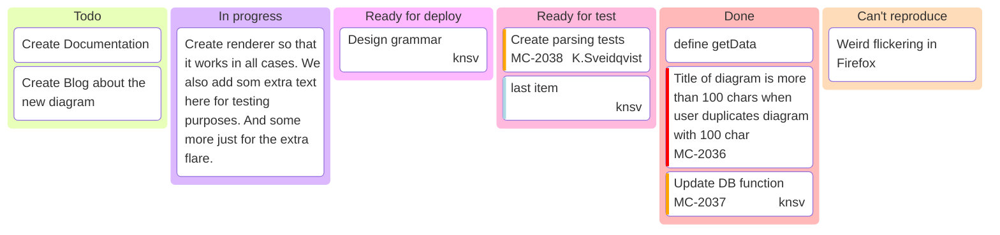

# Phone tree logic for KPradio.net
![[phonetree.png]] 
 Once a caller presses #1, a time condition is checked. If it's too late (10:00 PM to 7:00 AM PST), the caller is sent to a voice mailbox that tells them to call back later, and gives them the option to leave a voicemail. 
 If the time condition does not flag, the caller will be moved to the KP Radio Calling Queue. 
 There, the main SIP and queue is checked. If the mainline SIP (microSIP on PC) is unavailable or no one is logged into the queue to answer calls, send caller to the KP Radio ringer group.
 The KP radio ringer group consists of the mobile softphone client, and rotary phone connected to VOIP via ATA.
 From here, the call can be answered by either the rotary or mobile phone. This allows me to receive calls to the station, even when away, or when a broadcast is not currently live.

